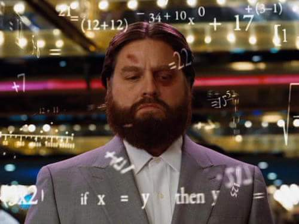

# decimal.h

Implementation of decimal.h library in the C programming language. This library added the ability to work with the "decimal" type, which is not in the language standard. Nevertheless, this type is critically important. For financial calculations, for example, where errors of calculations characteristic of types with floating point are unacceptable. The original library is used in C#.

## Structure decimal

 1) The first three elements of the bits array (96 bits) store the normalized form of the number.
 2) The fourth element of the bits array stores the characteristics of the number, namely the sign at the 31st bit position and the exponent.
 3) `value_type_t` - indicates whether it is a normal number (D_NORMAL_VALUE), nan (D_NAN), infinity (D_INFINITY), -infinity(D_NEGATIVE_INFINITY).
 4) This project defines `TRUE` - 0, and `FALSE` - 1.

## Arithmetic Operators

| Operator name | Operators  | Function | 
| ------ | ------ | ------ |
| Addition | + | decimal add(decimal, decimal) |
| Subtraction | - | decimal sub(decimal, decimal) |
| Multiplication | * | decimal mul(decimal, decimal) | 

If an error occurs during the operation, the error type is written to the value_type variable  

## Comparison Operators

| Operator name | Operators  | Function | 
| ------ | ------ | ------ |
| Less than | < | int is_less(decimal, decimal) |
| Less than or equal to | <= | int is_less_or_equal(decimal, decimal) | 
| Greater than | > |  int is_greater(decimal, decimal) |
| Greater than or equal to | >= | int is_greater_or_equal(decimal, decimal) | 
| Equal to | == |  int is_equal(decimal, decimal) |
| Not equal to | != |  int is_not_equal(decimal, decimal) |

Return value:
- 0 - TRUE
- 1 - FALSE

## Convertors and parsers

| Convertor/parser | Function | 
| ------ | ------ |
| From int  | int from_int_to_decimal(int src, decimal *dst) |
| From float  | int from_float_to_decimal(float src, decimal *dst) |
| To int  | int from_decimal_to_int(decimal src, int *dst) |
| To float  | int from_decimal_to_float(decimal src, float *dst) |

Return value - code error:
- 0 - SUCCESS
- 1 - CONVERTING ERROR

*Note on the conversion of a float type number:*
- *If the numbers are too small (0 < |x| < 1e-28), return an error and value equal to 0, value_type = 0*
- *If the numbers are too large (|x| > 79,228,162,514,264,337,593,543,950,335) or are equal to infinity, return an error and value_type of infinity with the corresponding sign*
- *When processing a number with the float type, convert all the digits contained in it*

*Note on the conversion from decimal type to int:*
- *If there is a fractional part in a decimal number, it should be discarded (for example, 0.9 is converted to 0)*

## Another functions

| Description | Function | 
| ------ | ------ |
| Rounds a specified Decimal number to the closest integer toward negative infinity. | decimal floor(decimal) |	
| Rounds a decimal value to the nearest integer. | decimal round(decimal) |
| Returns the integral digits of the specified Decimal; any fractional digits are discarded, including trailing zeroes. | decimal truncate(decimal) |
| Returns the result of multiplying the specified Decimal value by negative one. | decimal negate(decimal) |

## Implementation of the decimal.h library functions

- For start of build and tests program use `make test` in terminal
- The library developed in C language of C11 standard using gcc compiler
- Do not used outdated and legacy language constructions and library functions. Used the POSIX.1-2017 standard.
- It is a static library (with the decimal.h header file)
- The library developed according to the principles of structured programming;
- Prepared full coverage of library functions code with unit-tests using the Check library
- Unit tests covered at least `80%` of each function (checked using gcov)   
- Provided a Makefile for building the library and tests (with targets all, clean, test, decimal.a, gcov_report)  
- The gcov_report target generate a gcov report in the form of an html page.
- Don't use the __int128 type
- Trailing zeros preserved as deleted (except for the `truncate` function)
- The defined type supported numbers from -79,228,162,514,264,337,593,543,950,335 to +79,228,162,514,264,337,593,543,950,335.
- The program has only been tested on a macOS Big Sur and Ubuntu 20.04.
